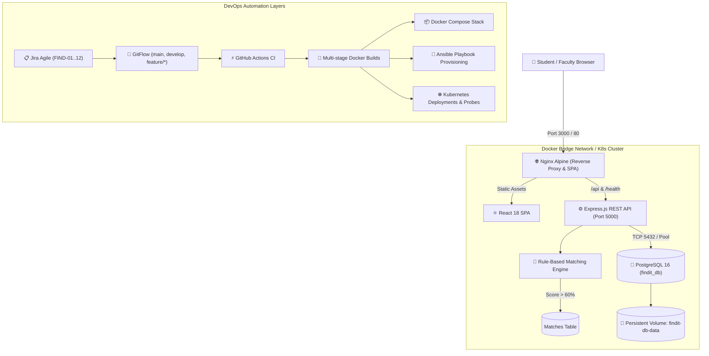

# FindIT — College Lost & Found Management System
> **DevOps Mini-Project (MPR) — Semester 5**  
> An end-to-end cloud-native lost and found portal integrating academic Experiments 1 through 7 into a single production-grade delivery lifecycle.

[](https://github.com/cyberbuddyshivam/FindIT/actions/workflows/ci.yml)


---

## 📌 Project Overview

**FindIT** streamlines lost property resolution across college campuses. It combines a clean, accessible React frontend with an Express/PostgreSQL backend and a deterministic **Rule-Based Matching Engine** that automatically matches Lost and Found item reports when similarity exceeds **60%**.

The primary objective of this project is demonstrating genuine, visible DevOps engineering across all syllabus experiments:

| Exp # | Syllabus Experiment Title | Key Technology / Artifact | Guide & Artifacts | Status |
|:---:|---|---|---|:---:|
| **1** | Agile Lifecycle using Jira + DevOps | Atlassian Jira Cloud (`FIND-01`..`12`), 2 Sprints, 5-column board | [Jira Board Guide](docs/jira/BOARD_SETUP.md) \| [Sprint Plan](docs/jira/SPRINT_PLAN.md) | ✅ Complete |
| **2** | Version Control using Git | GitFlow (`main`, `develop`, `feature/*`), PR template, Conventional Commits | [Git Workflow Guide](docs/GIT_WORKFLOW.md) \| [PR Template](.github/pull_request_template.md) | ✅ Complete |
| **3** | Continuous Integration using GitHub Actions | `.github/workflows/ci.yml`, Lint, Unit/API tests, Docker build | [CI Demo Guide](docs/CI_DEMO.md) \| [ci.yml](.github/workflows/ci.yml) | ✅ Complete |
| **4** | Provisioning & Configuration using Ansible | `ansible/playbook.yml`, `roles/docker`, `roles/app`, Idempotence | [Ansible Guide](docs/ANSIBLE.md) \| [Playbook](ansible/playbook.yml) | ✅ Complete |
| **5** | Containerization using Docker | Multi-stage `Dockerfile` (Alpine, non-root `node`, Healthchecks) | [Docker Guide](docs/DOCKER.md) \| [Backend Dockerfile](backend/Dockerfile) | ✅ Complete |
| **6** | Multi-Service Deployment using Docker Compose | `docker/docker-compose.yml`, health checks, network & volume isolation | [Compose Guide](docs/COMPOSE.md) \| [docker-compose.yml](docker-compose.yml) | ✅ Complete |
| **7** | Container Management using Kubernetes | Manifests in `k8s/`, Deployments, Probes, Scaling, Self-healing | [Kubernetes Guide](docs/KUBERNETES.md) \| [k8s Manifests](k8s/) | ✅ Complete |

---

## 🏗️ System Architecture



---

## 🧠 Rule-Based Matching Algorithm

When an item is reported, FindIT compares it against all active items of the opposite type (`LOST` $\leftrightarrow$ `FOUND`):

$$\text{Match Score} = S_{\text{category}} (30\%) + S_{\text{title}} (30\%) + S_{\text{location}} (25\%) + S_{\text{description}} (15\%)$$

- **Category (30 pts)**: Exact match = 30.0, else 0.0.
- **Title (30 pts)**: Token Jaccard Similarity $\times$ 30.0.
- **Location (25 pts)**: Token Jaccard Similarity $\times$ 25.0 (exact match = 25.0).
- **Description (15 pts)**: Stopword-filtered keyword overlap ratio $\times$ 15.0.
- **Threshold**: When Score $\ge 60.0\%$, a `POTENTIAL` match record is automatically generated and displays a "Possible Match" banner on the frontend UI.

---

## 🚀 The 4 Execution Modes

### Mode 1: Local Development (Bare-Metal Node.js)
```bash
# 1. Backend (Terminal 1)
cd backend
npm install
npm test            # Run 23 Jest tests
npm run dev         # Starts on http://localhost:5000

# 2. Frontend (Terminal 2)
cd frontend
npm install
npm run dev         # Starts on http://localhost:5173 (proxies :5000)
```

### Mode 2: Docker Compose (Recommended for Local Evaluation)
```bash
# Start all 3 microservices with health-dependent ordering
docker compose up -d --build

# Verify container health
docker compose ps

# Access application
# Frontend UI: http://localhost:3000
# Backend API: http://localhost:5000/api/items
# Health Check: http://localhost:5000/health

# Teardown
docker compose down
```

### Mode 3: Ansible Automated Provisioning
```bash
# Verify playbook syntax
ansible-playbook ansible/playbook.yml -i ansible/inventory/hosts.ini --syntax-check

# Execute idempotent host provisioning & deployment
ansible-playbook ansible/playbook.yml -i ansible/inventory/hosts.ini
```

### Mode 4: Kubernetes Cluster Deployment (Minikube / Kind)
```bash
# Apply all manifests to 'findit' namespace
kubectl apply -k k8s/

# Verify rollout and pod statuses
kubectl get all,pvc -n findit

# Port-forward or access frontend (NodePort 30080)
# Open http://localhost:30080 in your browser

# Self-healing test (delete a pod and watch it instantly regenerate)
kubectl delete pod -n findit -l app=backend --wait=false
kubectl get pods -n findit -w
```

---

## 🛠️ Unified Automation Shortcuts

Both a Unix `Makefile` and Windows PowerShell script `run.ps1` are provided for evaluator convenience:

| Command (Linux/macOS) | Command (Windows PowerShell) | Action |
|---|---|---|
| `make test` | `.\run.ps1 test` | Run Jest test suite (23 unit & API tests) |
| `make lint` | `.\run.ps1 lint` | Run ESLint across codebases |
| `make build` | `.\run.ps1 build` | Build Vite frontend bundle |
| `make compose-up` | `.\run.ps1 compose-up` | Start multi-container stack |
| `make compose-down` | `.\run.ps1 compose-down` | Stop compose stack |
| `make k8s-apply` | `.\run.ps1 k8s-apply` | Apply Kubernetes manifests |
| `make k8s-status` | `.\run.ps1 k8s-status` | Inspect Kubernetes cluster state |

---

## ⚙️ Environment Configuration

| Variable | Default Value | Description |
|---|---|---|
| `PORT` | `5000` | Backend HTTP listening port |
| `NODE_ENV` | `production` / `development` | Node execution environment |
| `DB_HOST` | `postgres` (compose) / `localhost` (local) | PostgreSQL host address |
| `DB_PORT` | `5432` | PostgreSQL port |
| `DB_USER` | `postgres` | Database username |
| `DB_PASSWORD` | `postgres` | Database password |
| `DB_NAME` | `findit_db` | Database schema name |
| `FRONTEND_URL`| `http://localhost:3000` | Allowed CORS origin |

---

## 🔧 Troubleshooting Guide

| Issue | Root Cause | Solution |
|---|---|---|
| Port 5432 already in use | Local PostgreSQL running on host | Set `DB_PORT=5433` in `.env` before running Docker Compose |
| Backend DB connection warning | PostgreSQL container still initializing | Backend automatically uses resilient in-memory storage fallback |
| Docker daemon not running | Docker Desktop is stopped | Start Docker Desktop application before running Compose / K8s |
| K8s pods in `ErrImageNeverPull` | Images not pre-built in Minikube/Kind cache | Run `docker compose build` or `minikube image load findit-backend:v1.0.0` |

---

## 📄 Documentation Links
- 📘 [Master Engineering Plan (`docs/PLAN.md`)](docs/PLAN.md)
- 📋 [Jira Agile Setup (`docs/jira/BOARD_SETUP.md`)](docs/jira/BOARD_SETUP.md)
- 🌿 [GitFlow Branching Workflow (`docs/GIT_WORKFLOW.md`)](docs/GIT_WORKFLOW.md)
- ⚡ [CI Pipeline Demo (`docs/CI_DEMO.md`)](docs/CI_DEMO.md)
- 🐳 [Docker Multi-Stage Containerization (`docs/DOCKER.md`)](docs/DOCKER.md)
- 📦 [Docker Compose Multi-Service Guide (`docs/COMPOSE.md`)](docs/COMPOSE.md)
- 📜 [Ansible Provisioning Guide (`docs/ANSIBLE.md`)](docs/ANSIBLE.md)
- ☸️ [Kubernetes Container Management (`docs/KUBERNETES.md`)](docs/KUBERNETES.md)
- 🎓 [Final Academic Report & Viva Voce Q&A (`docs/REPORT.md`)](docs/REPORT.md)
